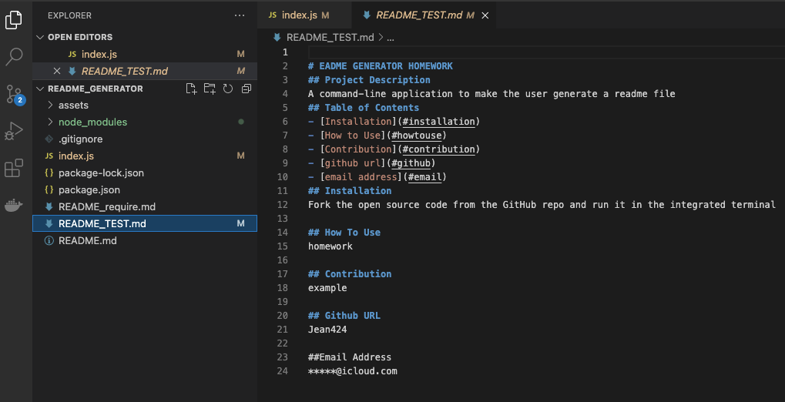

# README Genetator Homework

## Description

- This is a command-line application to make the user get prompted for the required questions and have it succesfully saved into a new readme.md file. 
With this application, the user can quickly create a professional README for a new project.

## How to use it

- WHEN it prompted for user's information about the application repository, THEN a professional README.md is generated with the project and sections entitled Description, Table of Contents, Installation, Usage, Contributing, Github and emails;
- WHEN the user enter the project title, THEN this is displayed as the title of the README;
- WHEN the user enter a description, installation instructions, how to use information and ontribution guidelines, THEN this information is added to the sections of the README entitled Description, Installation, how to use and Contributing;
- WHEN the user click on the links in the Table of Contents, THEN the user can taken to the corresponding section of the README;
- WHEN the user enter the GitHub URL, THEN this is added to the section of the README with a link to the GitHub profile;
- WHEN the user enter my email address, THEN this is added to the section of the README how to reach me with additional questions;

## Live link

- link to video of the produce of readme generate: https://watch.screencastify.com/v/95f4tlZuk0WoznOqK9w3

