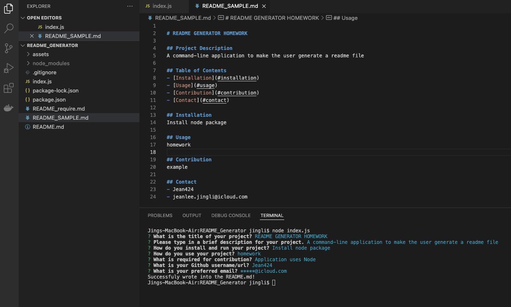

# README GENERATOR HOMEWORK

## Project Description
This is a command-line application to make the user get prompted for the required questions and have it succesfully saved into a new readme.md file. 

## Table of Contents
- [Installation](#installation)
- [How to Use](#howtouse)
- [Contribution](#contribution)
- [github url](#github)
- [email address](#email)

## Installation
This package uses Node and you will need to install Node in order to use this application. Just type "npm i" in the terminal in this project's file location.
      
## How To Use
To start you will need to navigate to the ReadMe Generator in your terminal using the change directory command (cd). Once you are at the directory you will need to apply the Node package ("npm i" command). Once Node is installed you can run "node index.js" to start up the program. You will then follow the prompts given in the terminal. After the prompts are filled out your ReadMe will be completed.
      
## Contribution
- Application uses Node

## Reach me with github
- Jean424

## Reach me with email
- jeanlee.jingli@icloud.com

## Live link

- link to video of the produce of readme generate: https://watch.screencastify.com/v/95f4tlZuk0WoznOqK9w3
- photo of the prompts in the terminal:
